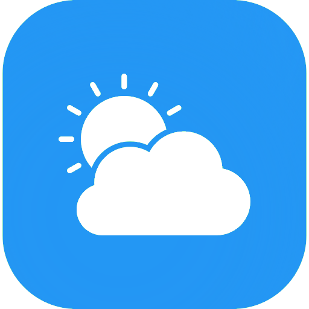

# Flutter Weather App



Welcome to the Flutter Weather App, a simple yet powerful weather forecasting application built with Flutter.

## Key Features

- Real-time weather updates
- Location-based weather forecasts
- 24-hour weather forecasts

## Getting Started

To get started with the Flutter Weather App, follow these steps:

1. Clone this repository:

```bash
git clone https://github.com/sungvzer/flutter_weather_app.git
```

2. Change into the project directory:
```bash
cd flutter_weather_app
```

3. Install dependencies
```bash
flutter pub get
```

4. Run the application
```bash
flutter run
```

## License

This project is licensed under the GNU GPLv3 License.

## Acknowledgments

- Flutter framework
- [OpenMeteo API](https://open-meteo.com/)
- [GeoCode API](https://geocode.maps.co/)
- Icons by [FontAwesome](https://fontawesome.com/)
- Weather app icon created by [kliwir art - Flaticon](https://www.flaticon.com/free-icon/weather-app_9502324)
